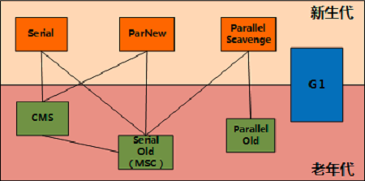
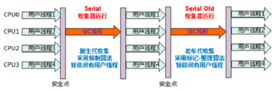
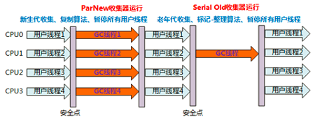
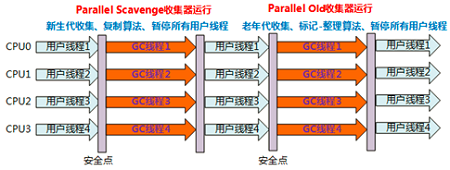

### MyIsam和Innodb
* MyIsam不支持事务行级锁和外键约束，锁的粒度是表级，是非事务安全的，InnoDB支持行级锁，是事务安全的。
* MyIsam支持全文型索引，InnoDB不支持。
* MyIsam管理非事务表，提供高速存储和全文搜索能力，若需要执行大量SELECT查询，MyIsam是更好选择。
* InnoDB用于事务处理应用程序，ACID事务支持。若需要执行大量的INSERT或UPDATE操作，使用InnoDB可以提高多用户并发操作的性能。
***

### JVM垃圾回收

- 并行和并发
- Minor GC和Full GC 
  - Minor称为新生代GC,发生在新生代的垃圾收集，Minor GC较频繁，回收速度也较快
  - 又称Major GC或老年代GC,发生在老年代的垃圾收集，在老年代空间、方法区空间不足时触发 
- Serival，针对新生代、采用复制算法和单线程收集，进行垃圾收集时。必须暂停所有工作线程，“Stop The World”
- Serial Old，针对老年代，采用标记-整理算法(还有MSC)，单线程收集。

- ParNew是Serial收集器的多线程版本,可用控制参数、收集算法、Stop The World、内存分配规则、回收策略等行为特点与Serial一样。但在单个CPU中，因为存在线程开销问题，效果没Serial好。

- Parallel Scavenge又称吞吐量收集器，新生代、复制算法、多线程，目标达到一个可控制的吞吐量：减少垃圾收集时间,让用户代码获得更长的运行时间。
- Parallel Old是Parallel Scavenge的老年代版本，老年代、标记整理算法、多线程收集

- CMS也称为并发低停顿收集器或低延迟垃圾收集器,针对老年代、标记清除、并发收集和低停顿, 与用户交互较多的场景,常见WEB、B/S系统的服务器上的应用。

- G1垃圾收集

***

### java中基本数据类型是什么？占多少字节
- JAVA中8种基本数据类型：byte(8位)、short(16)、int(32)、long(64)、float(32)、double(64)、char(16)、boolean;
***

### String类能被继承？为什么
- String类有final修饰关键字修饰，所以不能被继承;
***

### Java中的String，StringBuilder，StringBuffer三者的区别
- 运行速度:StringBuilder>StringBuffer>String,前两为字符串变量可以被修改,但String是字符串常量,不能被修改;线程安全上,StringBuilder是线程不安全的,而StringBuffer是线程安全的;StringBuilder相较于StringBuffer有速度优势，所以多数情况下建议使用 StringBuilder类。然而在应用程序要求线程安全的情况下，则必须使用StringBuffer 类
***

### Java中ArrayList和LinkedList区别
- ArrayList是动态数组, 适用于查找操作，LinkedList是基于链表适用于新增和删除;
***

### 用过哪些 Map 类，都有什么区别，HashMap 是线程安全的吗,并发下使用的 Map 是什么，他们内部原理分别是什么，比如存储方式，hashcode，扩容,默认容量
- HashMap不是线程安全的，HashTable是线程安全的，但同步会带来性能开销，在不需要线程安全下，HashMap性能较好，Hashmap的迭代器初始化时会将modecount赋给迭代器的exceptedmodcount，在迭代过程中，判断modcount和exceptedmodcount是否相等，若不相等，则说明其他线程修改了map，抛出异常，这就是所谓的fail-fast策略
- LinkedHashMap，父类是HashMap,在HashMap基础上，在内部增加了一个链表，使用双向链表维护键值对次序，插入元素时性能低于HashMap，迭代访问时有很好性能
* TreeMap，根据元素的Key进行排序，Map接口派生sortMap子接口，为sortMap的实现类，Treemap的key以TreeSet形式存储
* HashMap内部Node数组默认大小16，自动扩容机制，重新计算容量，向HashMap对象里不断添加元素，当对象内部的数组无法装载更多元素时,使用新的数组代替已有容量小的数组
***

### JAVA8的ConcurrentHashMap为什么放弃了分段锁，有什么问题吗，如果你来设计，如何设计
* 并发编程中，使用频繁，提供了更好的写并发能力，大量使用了volatile，final，CAS等lock-free技术来减少锁竞争对于性能的影响
* 分段锁Segment继承ReentrantLock，只在同一个分段内存在竞态关系，不同分段锁之间没有锁竞争，多线程访问容器中不同数据段的数据时，线程间就不会存在锁竞争，相比于对整个Map加锁，大大提高了高并发环境下的处理能力
* 而在JDK1.8中摒弃了Segment分段锁机制，利用CAS+Synchronized来保证并发更新的安全，底层依然采用数组+链表+红黑树存储结构(降低时间复杂度)
***

### 抽象类和接口的区别
* 有抽象方法的类均叫做抽象类，抽象方法必须用abstract关键词修饰，抽象方法必须是public或protected(若为private，不能被子类继承),抽象类不能用来创建对象，继承抽象类的子类必须实现抽象方法，若没有实现，则必须将子类也定义为抽象类
* 接口中所有方法不能有具体实现，必须都是抽象方法使用public abstract修饰，变量要隐指定为public static final变量
* 抽象类是对一种事物的抽象，对类的抽象，接口是对行为的抽象，对于抽象类，如果需要添加新的方法，可以直接在抽象类中添加具体的实现，子类可以不进行变更；而对于接口则不行，如果接口进行了变更，则所有实现这个接口的类都必须进行相应的改动
* 一般的应用里，最顶级的是接口，然后是抽象类实现接口，最后才到具体类实现
***

### 讲讲理解的NIO
* NIO同步非阻塞IO模型，同步是指线程不断轮询 IO 事件是否就绪，非阻塞是指线程在等待 IO 的时候，可以同时做其他任务
* 同步的核心就是 Selector，Selector 代替了线程本身轮询 IO 事件，避免了阻塞同时减少了不必要的线程消耗
* 非阻塞的核心就是通道和缓冲区，当 IO 事件就绪时，可以通过写到缓冲区，保证 IO 的成功，而无需线程阻塞式地等待
***

### 反射的原理及创建类的三种方式
* 是在运行状态中，对于任意一个类，都能都知道这个类的所有属性和方法，对于任意一个对象，都能够调用它的任意一个方法和属性，这种动态获取的信息以及动态调用对象的方法称之为反射
* model.getClass(),Model.class,Class.forName("Model")
***