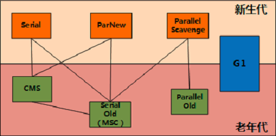

## 代码执行顺序：
* 父类静态代码块->子类静态代码块->main()方法->父类构造代码块->父类构造方法->子类构造代码块->子类构造方法
* 普通代码块和一般的语句执行顺由出现的次序决定
* 构造代码块的执行次序优先于类构造函数
* 每个静态代码块只会执行一次，静态代码块先于主方法执行
* 如果类中包含多个静态代码块，那么将按照出现次序执行
***
## volatile
* i = i + 1此操作会触发缓存不一致问题，在并发编程中，通常会遇到原子性、可见性和有序性问题。
* 原子性：即一个操作或者多个操作要么全部执行并且执行的过程不会被任何因素打断，要么就都不执行。
* 一个线程修改了某个变量的值，其他线程能够立即看得到修改的值。
* 程序执行的顺序按照代码的先后顺序执行，指令重排序不会影响单个线程的执行，但是会影响到线程并发执行的正确性。
* 想并发程序正确地执行，必须要保证原子性、可见性以及有序性
* volatile修饰的成员变量、静态成员变量，一个线程修改了变量值，对其他线程是立即可见的，并且禁止指令重排,volatile某些情况下性能优于synchronized，但由于volatile无法保证原子性,不是线程安全的。
***
## 依赖注入三种方式
* setter方法、构造方法和基于注解注入,Java类会先执行构造方法，然后再给注解了@Autowired 的user注入值，所以在执行构造方法的时候，就会报错。
***
# Object
* Object类常用方法：toString、equals、hashCode、finalize、wait、notify。
* toString将对象信息变为字符串返回，默认输出对象地址，可以在子类中重写object类的toString方法输出对象属性信息。
* equals方法用于比较对象是否相等，而且此方法必须被重写，因为object中的equals方法与== 均是比较对象的地址,像String类是对equals方法进行了重写。
```java
public boolean equals(Object obj) {
    return (this == obj);
    }
```
* clone，用途是用来另存一个当前存在的对象。
* hashCode方法，该方法用来返回其所在对象的物理地址（哈希码值），常会和equals方法同时重写，确保相等的两个对象拥有相等的hashCode。
* wait、notify，wait释放obj对象锁，进入线程等待队列，notify通知等待队列中的第一个线程去获得该对象锁。
* finalize 进行垃圾回收时候会用到
***
## Objects
* Objects是java.util包下的工具类，具有的方法：compare、equals/deepEquals、hash/hashCode、isNull/nonNull、toString、requireNonNull。
***
## java8流式处理：函数式接口和Lambda表达式
[Stream流式处理](https://www.ibm.com/developerworks/cn/java/j-lo-java8streamapi/ )
***
## StringBuffer和StringBuild
* StringBuilder相较于StringBuffer有速度优势，所以多数情况下建议使用 StringBuilder类。然而在应用程序要求线程安全的情况下，则必须使用StringBuffer 类。
***
## 锁
* 共享锁：又称读锁，事务T对对象A加了S锁，则事务T可以读A但不能修改A,其他事务可以读A，但在事务T释放S锁前，不能对A做任何操作。
* 排他锁：又称写锁，事务T对对象A加了X锁，则事务T可以读A也可以修改A，其他事务在事务T释放S锁前，不能对A读和写。
* 互斥锁：一个执行单元要想访问被自旋锁保护的共享资源，必须先得到锁，在访问完共享资源后，必须释放锁。
* 自旋锁：如果在获取自旋锁时锁已经有保持者，那么获取锁操作将自旋在那里，直到该自旋锁的保持者释放了锁。
* 可重入锁：一个线程在获取了锁之后，再次去获取了同一个锁，这时候仅仅是把状态值进行累加
* 双重检查锁，在单例模式中，
* 死锁：互斥、请求和保持、不剥夺和循环等待
***
### MyIsam和Innodb
* MyIsam不支持事务行级锁和外键约束，锁的粒度是表级，是非事务安全的，InnoDB支持行级锁，是事务安全的。
* MyIsam支持全文型索引，InnoDB不支持。
* MyIsam管理非事务表，提供高速存储和全文搜索能力，若需要执行大量SELECT查询，MyIsam是更好选择。
* InnoDB用于事务处理应用程序，ACID事务支持。若需要执行大量的INSERT或UPDATE操作，使用InnoDB可以提高多用户并发操作的性能。
***
### JVM垃圾回收

- 并行和并发
- Minor GC和Full GC 
  - Minor称为新生代GC,发生在新生代的垃圾收集，Minor GC较频繁，回收速度也较快
  - 又称Major GC或老年代GC,发生在老年代的垃圾收集，在老年代空间、方法区空间不足时触发 
- Serival，针对新生代、采用复制算法和单线程收集，进行垃圾收集时。必须暂停所有工作线程，“Stop The World”
- Serial Old，针对老年代，采用标记-整理算法(还有MSC)，单线程收集。

- ParNew是Serial收集器的多线程版本,可用控制参数、收集算法、Stop The World、内存分配规则、回收策略等行为特点与Serial一样。但在单个CPU中，因为存在线程开销问题，效果没Serial好。

- Parallel Scavenge又称吞吐量收集器，新生代、复制算法、多线程，目标达到一个可控制的吞吐量：减少垃圾收集时间,让用户代码获得更长的运行时间。
- Parallel Old是Parallel Scavenge的老年代版本，老年代、标记整理算法、多线程收集

- CMS也称为并发低停顿收集器或低延迟垃圾收集器,针对老年代、标记清除、并发收集和低停顿, 与用户交互较多的场景,常见WEB、B/S系统的服务器上的应用。

- G1垃圾收集

***


