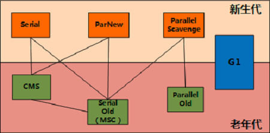
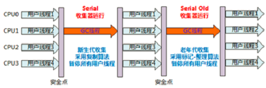
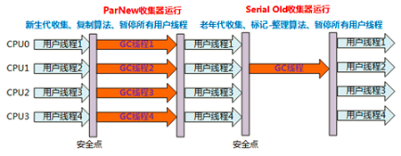
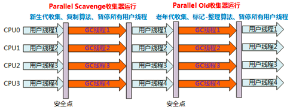
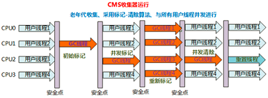
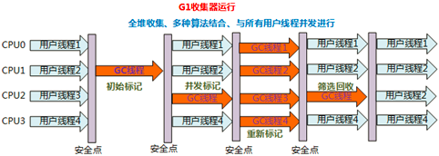

## MyIsam和Innodb
* MyIsam不支持事务行级锁和外键约束，锁的粒度是表级，是非事务安全的，InnoDB支持行级锁，是事务安全的。
* MyIsam支持全文型索引，InnoDB不支持。
* MyIsam管理非事务表，提供高速存储和全文搜索能力，若需要执行大量SELECT查询，MyIsam是更好选择。
* InnoDB用于事务处理应用程序，ACID事务支持。若需要执行大量的INSERT或UPDATE操作，使用InnoDB可以提高多用户并发操作的性能。

## JVM垃圾回收

* 并行和并发
* Minor GC和Full GC 
  * Minor称为新生代GC,发生在新生代的垃圾收集，Minor GC较频繁，回收速度也较快
  * 又称Major GC或老年代GC,发生在老年代的垃圾收集，在老年代空间、方法区空间不足时触发 
* Serival，针对新生代、采用复制算法和单线程收集，进行垃圾收集时。必须暂停所有工作线程，“Stop The World”。
* Serial Old，针对老年代，采用标记-整理算法(还有MSC)，单线程收集。

* ParNew是Serial收集器的多线程版本,可用控制参数、收集算法、Stop The World、内存分配规则、回收策略等行为特点与Serial一样。但在单个CPU中，因为存在线程开销问题，效果没Serial好。

* Parallel Scavenge又称吞吐量收集器，新生代、复制算法、多线程，目标达到一个可控制的吞吐量：减少垃圾收集时间,让用户代码获得更长的运行时间。
* Parallel Old是Parallel Scavenge的老年代版本，老年代、标记整理算法、多线程收集

* CMS也称为并发低停顿收集器或低延迟垃圾收集器,针对老年代、标记清除、并发收集和低停顿, 与用户交互较多的场景,常见WEB、B/S系统的服务器上的应用。

* G1

