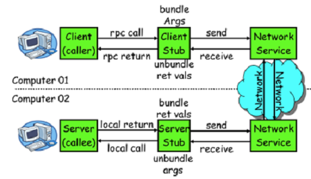

### RPC调用

* 多个服务协同完成一次业务时，由于业务约束（如红包不符合使用条件、账户余额不足等）、系统故障（如网络或系统超时或中断、数据库约束不满足等），都可能造成服务处理过程在任何一步无法继续，使数据处于不一致的状态。传统的基于数据库本地事务的解决方案只能保障单个服务的一次处理具备原子性、隔离性、一致性与持久性，但无法保障多个分布服务间处理的一致性
* 分析源代码，基本原理如下：
  * client 一个线程调用远程接口，生成一个唯一的 ID （比如一段随机字符串， UUID 等） , Dubbo 是使用 AtomicLong 从 0 开始累计数字的
  * 将打包的方法调用信息（如调用的接口名称，方法名称，参数值列表等），和处理结果的回调对象 call back ，全都封装在一起，组成一个对象 0bject 
  * 向专门存放调用信息的全局 ConcurrentHashMap 里面 put ( ID , object ) 
  * 将 ID 和打包的方法调用信息封装成一对象 connRequest ，使用 Iosession . write ( connRequest ）异步发送出去 
  * 当前线程再使用 call back 的 get ( ）方法试图获取远搔返回的结果，在 get ( ）内部，则使用 Synchronized 获取回调对象 caIlback 的锁，再先检测是否已经获取到结果，如果没有，然后调用 callbaCk 的 wait ( ）方法，释放 callback 上的锁，让当前线程处于等待状态。
  * 服务端接收到请求并处理后，将结果（此结果中包含了前面的 ID ，即回传）发送给客户端，客户端 socket连接上专门监听消息的线程收到消息，分析结果，取到 ID ，再从前面的ConcurrentHashMap里面 get ( ID ) ，从而找到 callback ，将方法调用结果设置到 callback 对象里。 
  * 监听线程接着使用 synchronized 获取回调对象 callback 的锁（因为前面调用过 wait ( ) ，那个线程已释放 callback 的锁了），再 notlfyAll ( ) ，唤醒前面处于等待状态的线程继续执行（ call back 的 get ( ）方法继续执行就能拿到调用结果了），至此，整个过程结束。
* 当前线程怎么让它暂停，等结果回来后，再向后执行？
  * 先生成一个对象obj ，在一个全局 map 里 put ( 1D obj ）存放起来，再用synchronized获取obj锁，再调用obj.wait()让当前线程处于等待状态，然后另一消息监听线程等到服务端结果来了后，再 map.get （ID ）找到 obj ，再用 synchronized获取obj 锁，再调用obj.notifyAll唤配前面处于等待状态的线程
  * Socket 通信是一个全双工的方式，如果有多个线程同时进行远程方法调用，这时建立在client server之间的socket连接上会有很多双方发送的消息有传递，前后顺序也可能是乱七八嘈的，server处理完结果后，将结果消息发送给 client, client收到很多消息，怎么知道消息结果是原先哪个线程调用的? 使用一个ID ，让其唯一，然后传递给服务端，再服务端又回传回来，这样就知道结果是原先哪个线程的了
***

### 反射实例 requestToModel(request,outClass)
* outClass(PreLoanAssets.class) 获取newInstance(outClass)对象 outModel
* 通过request对象获取所有字段getAllFieldsOfObject(request) allFields
    * 获取request对象的类对象,Class<?> requestClass = request.getClass()
    * 获取所有声明的字段,Field[] requestFields = requestClass .getDeclaredFields()
    * Map<String,FieldInfo> allFields = new HashMap<>(requestFields.length)
    * requestFields 中 非静态 非Neglected{字段f.getAnnotation(Neglected.class)}
    * 取原始字段名 映射字段名 字段值
        * f.getName() 获取字段名
        * getFieldName(requestClass, f)，getMappingFieldName(f, originalFieldName)，MapToField mapToField =field.getAnnotation(MapToField.class); 返回mapToField 获取映射字段名
        * getGetterMethodFromClass(requestClass, fieldName);
        * String getterName = String.format("get%c%s", Character.toUpperCase(fieldName.charAt(0))
        * ,fieldName.substring(1));Method method = requestClass.getMethod(getterName)
        * 获取request类的getXXX方法invokeMethod(method, request);执行该get方法，返回字段值fieldValue
        * 将获取的映射字段名作为键，FieldInfo(原始字段名、字段类型、字段值)作为值存入allFields中
* 依此获取FieldInfo字段信息 映射字段名fName、字段类型fClass、字段值fValue 获取set方法 执行set方法
    * FieldInfo fi = allFields.get(fName); Class<?> fClass = fi.fieldClass;  Object fValue = fi.fieldValue;
    * Method setter = ReflectUtil.getSetterMethodFromClass(outClass, fName, fClass);获取setter方法
        * String setterName = String.format("set%s%s",Character.toUpperCase(fieldName.charAt(0)),fieldName.subString(1));
        * Method method = outClass.getMethod(setterName,fClass);
        * ReflectUtil.invokeMethod(setter, outModel, fValue);执行setter方法；
* 返回outModel
***
