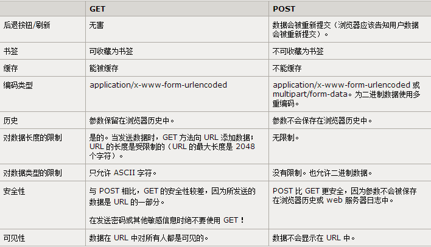

### HTTP1.0和1.1
* HTTP 1.0主要有以下几点变化： 
    * 请求和相应可以由于多行首部字段构成 
    * 响应对象前面添加了一个响应状态行 
    * 响应对象不局限于超文本 
    * 服务器与客户端之间的连接在每次请求之后都会关闭 
    * 实现了Expires等传输内容的缓存控制 
    * 内容编码Accept-Encoding、字符集Accept-Charset等协商内容的支持 
* HTTP 1.1加入了很多重要的性能优化：持久连接、分块编码传输、字节范围请求、增强的缓存机制、传输编码及请求管道。 
***
### Http和Https
* 使用完全不同的连接方式,用的端口也不一样,前者是80,后者是443。http的连接很简单,是无状态的,HTTPS协议是由SSL+HTTP协议构建的可进行加密传输、身份认证的网络协议,要比http协议安全
***
### TCP三次握手和四次挥手的流程，为什么建立和断开分别是3次和4次
* 握手为什么三次，客户端向服务端发送建立连接请求，如果这个时候client收不到server的应答，那么客户端会超时重发连接请求并得到服务器端的响应，正常建立连接，当数据传输完毕，释放了此次TCP连接，此时第一次发送的连接请求段延迟了一段时间后，到达了服务器端，但服务器端收到该连接请求后误以为客户端又发出了一次新的连接请求，于是服务器端向客户端发出确认应答报文段，并同意建立连接，但此时客户端并没有数据需要发送，而服务端却一直在等待接受客户端的数据，造成严重占用服务器资源
* 挥手为什么四次，在关闭TCP连接时，当收到客户端的FIN报文时，仅仅表示已经没有数据发送给服务端，但是服务端可能还有数据需要发送给客户端，则等服务端发送完剩余的数据给客户端之后，再发送FIN报文给客户端来表示服务端数据已经发送完毕，并请求关闭连接，所以通常情况下，这里的ACK报文和FIN报文都是分开发送的。
***
### TIME_WAIT和 CLOSE_WAIT的区别
* TIME_WAIT状态就是用来重发可能丢失的ACK报文
* TIME_WAIT 表示主动关闭，CLOSE_WAIT 表示被动关闭
***
### 说说你知道的几种 HTTP 响应码，比如 200, 302, 404
* 1xx：信息，请求收到，继续处理 
* 2xx：成功，行为被成功地接受、理解和采纳 
* 3xx：重定向，为了完成请求，必须进一步执行的动作 
* 4xx：客户端错误，请求包含语法错误或者请求无法实现 
* 5xx：服务器错误，服务器不能实现一种明显无效的请求 
* 200 一切正常 
* 302 代表暂时性转移，意思就是你访问网址A，但是网址A因为服务器端的拦截器或者其他后端代码处理的原因，会被重定向到网址B
* 404 无法找到指定位置的资源
***
### 当你用浏览器打开一个链接的时候，计算机做了哪些工作步骤
* Dns解析–>端口分析–>tcp请求–>服务器处理请求–>服务器响应–>浏览器解析—>链接关闭
***
### TCP/IP 如何保证可靠性，说说 TCP 头的结构
* 使用序号，对收到的TCP报文段进行排序以及检测重复的数据，使用校验和来检测报文段的错误，使用确认和计时器来检测和纠正丢包或延时
* 头结构：
    * 源端口号
    * 目的端口号
    * 序列号、确认号
    * TCP头部长度
    * 6位标志位
    * 16位窗口大小
    * 16位TCP校验和
    * 16位紧急指针
***
### 如何避免浏览器缓存
* 无法被浏览器缓存的请求： 
* HTTP信息头中包含Cache-Control:no-cache，pragma:no-cache，或Cache-Control:max-age=0等告诉浏览器不用缓存的请求 
* 需要根据Cookie，认证信息等决定输入内容的动态请求是不能被缓存的 
* 经过HTTPS安全加密的请求（有人也经过测试发现，ie其实在头部加入Cache-Control：max-age信息，firefox在头部加入Cache-Control:Public之后，能够对HTTPS的资源进行缓存） 
* POST请求无法被缓存 ，HTTP响应头中不包含Last-Modified/Etag，也不包含Cache-Control/Expires的请求无法被缓存
***
### 简述 ttp请求get和post的区别以及数据包格式、HTTP请求的报文格式
- 
***
- 
***
### HTTPS的加密方式是什么，讲讲整个加密解密流程
* 加密方式是tls/ssl，底层是通过对称算法，非对称，hash算法实现，客户端发起HTTPS请求 –》2. 服务端的配置 –》 3. 传送证书 —》4. 客户端解析证书 5. 传送加密信息 6. 服务段解密信息 7. 传输加密后的信息 8. 客户端解密信息 
***
