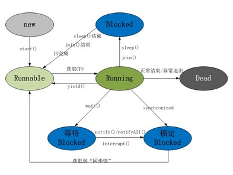

### 多线程的几种实现方式，什么是线程安全？
* 继承Thread类重写run方法，并通过调用.start()方法，启动线程
* 实现Runnable接口(Callable接口)重写run方法，Runnable接口的方式解决了Java单继承的局限，Runnable接口实现多线程比继承Thread类更加能描述数据共享的概念
* 如果所在的进程中有多个线程在同时运行，而这些线程可能会同时运行，如果每次运行结果和单线程运行的结果是一样的，而且其他的变量的值也和预期的是一样的，那么就是线程安全的
* 多线程的三个核心：原子性、可见性、顺序性
***
### volatile原理，作用，能代替锁？
* 原理：JVM就会向处理器发送一条Lock前缀的指令，将这个变量所在缓存行的数据写回到系统内存
* 保存内存的可见性，所有线程都能看到共享内存的最新状态
* 防止指令重排：为了实现volatile的内存语义，编译器在生成字节码时，会在指令序列中插入内存屏障来禁止特定类型的处理器重排序
* 使用场景：1 对变量的写操作不依赖于当前值，2 该变量没有包含在具有其他变量的不变式中
* 不能代替锁，volatile不能保证原子性
* CAS: 三个参数(V,A,B)，一个当前内存值V、旧的预期值A、即将更新的值B，当且仅当预期值A和内存值V相同时，将内存值修改为B并返回true，否则什么都不做
* CAS+volatile的非阻塞乐观锁的方式来降低同步锁带来的阻塞性能的问题,实现对共享变量的访问
***
### 线程的生命周期状态图
- 
* 线程通过new方法创建，调用start()方法，线程进入就绪态，等待系统的调度（时间片轮转调度），当系统调度，进入运行状态，正常结束或者异常退出，进程进入死亡状态
* 处于运行状态的线程若遇到sleep()方法，则线程进入睡眠状态，不会让出资源锁，sleep()方法结束，线程转为就绪状态，等待系统重新调度
* 处于运行状态的线程可能在等待IO，也可能进入挂起状态，IO完成，转为就绪状态
* 处于运行状态的线程yield()方法，线程转为就绪状态（yield只让给权限比自己高的）
* 处于运行状态的线程遇到wait() 方法（object的方法），线程处于等待状态，需要notify()/notifyALL()来唤醒线程，唤醒后的线程处于锁定状态，获取了“同步锁”之后，线程才转为就绪状态
* 处于运行的线程加synchronized锁变成同步操作,处于锁定状态，获取了“同步锁”之后，线程才转为就绪状态
***
### sleep和wait的区别
* sleep()方法导致了程序暂停执行指定的时间，让出cpu给其他线程，但是他的监控状态依然保持，当指定的时间到了又会自动恢复运行状态，在调用sleep()方法的过程中，线程不会释放对象锁。
* 当调用wait()方法的时候，线程会放弃对象锁，进入等待此对象的等待锁定池，只有针对此对象调用notify()方法后，本线程才进入对象锁定池准备
### Lock和Synchronized的区别
* L是接口，S是关键字
* S是在JVM层面上实现的，可以监控S的锁定，并在代码执行时出现异常，JVM会自动释放锁定，L是通过代码实现的，要保证锁一定会被释放，就必须将unLock()放到finally{}中
* L可以当等待锁的线程响应中断，S不行，使用S时等待的线程会一直等待下去，不能响应中断
* L锁可以通过多种方法来尝试获取锁，S不可以
* L可以提高多个线程进行读写操作的效率
***