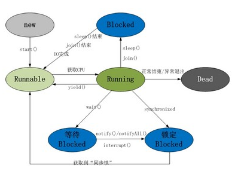
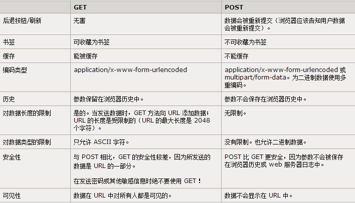
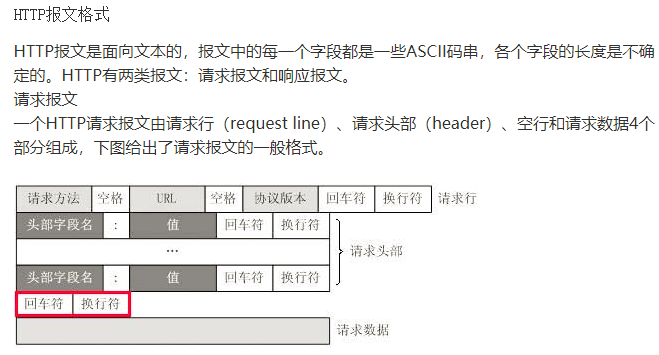

# java基础
### java中基本数据类型是什么？占多少字节
- JAVA中8种基本数据类型：byte(8位)、short(16)、int(32)、long(64)、float(32)、double(64)、char(16)、boolean;
***

### String类能被继承？为什么
- String类有final修饰关键字修饰，所以不能被继承;
***

### Java中的String，StringBuilder，StringBuffer三者的区别
- 运行速度:StringBuilder>StringBuffer>String,前两为字符串变量可以被修改,但String是字符串常量,不能被修改;线程安全上,StringBuilder是线程不安全的,而StringBuffer是线程安全的;StringBuilder相较于StringBuffer有速度优势，所以多数情况下建议使用 StringBuilder类。然而在应用程序要求线程安全的情况下，则必须使用StringBuffer类
***

### Java中ArrayList和LinkedList区别
- ArrayList是动态数组, 适用于查找操作，LinkedList是基于链表适用于新增和删除;
***

### 用过哪些 Map 类，都有什么区别，HashMap 是线程安全的吗,并发下使用的 Map 是什么，他们内部原理分别是什么，比如存储方式，hashcode，扩容,默认容量
- HashMap不是线程安全的，HashTable是线程安全的，但同步会带来性能开销，在不需要线程安全下，HashMap性能较好，Hashmap的迭代器初始化时会将modecount赋给迭代器的exceptedmodcount，在迭代过程中，判断modcount和exceptedmodcount是否相等，若不相等，则说明其他线程修改了map，抛出异常，这就是所谓的fail-fast策略
- LinkedHashMap，父类是HashMap,在HashMap基础上，在内部增加了一个链表，使用双向链表维护键值对次序，插入元素时性能低于HashMap，迭代访问时有很好性能
* TreeMap，根据元素的Key进行排序，Map接口派生sortMap子接口，为sortMap的实现类，Treemap的key以TreeSet形式存储
* HashMap内部Node数组默认大小16，自动扩容机制，重新计算容量，向HashMap对象里不断添加元素，当对象内部的数组无法装载更多元素时,使用新的数组代替已有容量小的数组
***

### JAVA8的ConcurrentHashMap为什么放弃了分段锁，有什么问题吗，如果你来设计，如何设计
* 并发编程中，使用频繁，提供了更好的写并发能力，大量使用了volatile，final，CAS等lock-free技术来减少锁竞争对于性能的影响
* 分段锁Segment继承ReentrantLock，只在同一个分段内存在竞态关系，不同分段锁之间没有锁竞争，多线程访问容器中不同数据段的数据时，线程间就不会存在锁竞争，相比于对整个Map加锁，大大提高了高并发环境下的处理能力
* 而在JDK1.8中摒弃了Segment分段锁机制，利用CAS+Synchronized来保证并发更新的安全，底层依然采用数组+链表+红黑树存储结构(降低时间复杂度)
***

### 抽象类和接口的区别
* 有抽象方法的类均叫做抽象类，抽象方法必须用abstract关键词修饰，抽象方法必须是public或protected(若为private，不能被子类继承),抽象类不能用来创建对象，继承抽象类的子类必须实现抽象方法，若没有实现，则必须将子类也定义为抽象类
* 接口中所有方法不能有具体实现，必须都是抽象方法使用public abstract修饰，变量要隐指定为public static final变量
* 抽象类是对一种事物的抽象，对类的抽象，接口是对行为的抽象，对于抽象类，如果需要添加新的方法，可以直接在抽象类中添加具体的实现，子类可以不进行变更；而对于接口则不行，如果接口进行了变更，则所有实现这个接口的类都必须进行相应的改动
* 一般的应用里，最顶级的是接口，然后是抽象类实现接口，最后才到具体类实现
***

### 讲讲理解的NIO
* NIO同步非阻塞IO模型，同步是指线程不断轮询 IO 事件是否就绪，非阻塞是指线程在等待 IO 的时候，可以同时做其他任务
* 同步的核心就是 Selector，应用多路复用技术，Selector代替了线程本身轮询IO事件，避免了阻塞同时减少了不必要的线程消耗
* 非阻塞的核心就是通道和缓冲区，当 IO 事件就绪时，可以通过写到缓冲区，保证 IO 的成功，而无需线程阻塞式地等待
***

### 反射的原理及创建类的三种方式
* 是在运行状态中，对于任意一个类，都能都知道这个类的所有属性和方法，对于任意一个对象，都能够调用它的任意一个方法和属性，这种动态获取的信息以及动态调用对象的方法称之为反射
* model.getClass(),Model.class,Class.forName("Model")
***
### 类加载过程
* 加载、验证、准备、解析和初始化
* 加载：通过一个类的全限定名来获取定义此类的二进制字节流，
将这个字节流所代表的静态存储结构转化为方法区的运行时数据结构，
在内存中(方法区)生成一个代表这个类的java.lang.Class对象
* 验证：确保Class文件的字节流中包含的信息符合当前虚拟机的要求，
并且不会危害虚拟机自身的安全
* 准备：为类变量(static成员变量)分配内存并设置类变量初始值的阶段，
这些变量所使用的内存都将在方法区中进行分配
* 解析：虚拟机将常量池内的符号引用替换为直接引用的过程
* 初始化：真正开始执行类中定义的java程序代码(字节码)
* 一个Java对象的创建过程往往包括 类初始化和类实例化两个阶段，要想创建一个类的实例，必须先将该类加载到内存并进行初始化，也就是说类初始化操作是在类实例化操作之前进行的，类的初始化是指类加载过程中的初始化阶段对类变量按照程序猿的意图进行赋值的过程，而类的实例化是指在类完全加载到内存中后创建对象的过程
***
### Class.forName和ClassLoader区别
* Class.forName得到的class是已经初始化完成的，ClassLoader得到的class是还没有链接的，静态块和静态对象不会得到执行
***
###  描述动态代理的几种实现方式，分别说出相应的优缺点
* JDK动态代理：只能代理实现了接口的类，代理对象本身并不真正实现服务，而是通过调用委托类的对象相关方法，提供特定服务，通过接口中的方法名，在动态生成的代理类中调用委托实现类的同名方法
* cgli代理：针对类实现代理，通过字节码技术为一个类创建子类，并在子类中采用方法拦截的技术拦截所有父类方法的调用，顺势织入横切逻辑，通过继承业务类，生成的动态代理类是业务类的子类，通过重写业务方法进行代理
***
### final的用途
* 可以用来修饰类、方法和变量,修饰类时表示类不能被继承，类中所有成员变量会隐式的指定为final方法
* 修饰方法，防止继承类修改方法，类的private方法会隐式指定为final方法
* 修饰变量，如果是引用变量，初始化之后便不能再让其指向另一个对象，如果是基本类型的变量，一旦初始化之后便不能更改
***
### 三种单例模式
* 懒汉式:线程是不安全的，若多个线程同时进入if(uniqueInstance==null)
```java
public class Singleton {
    private static Singleton uniqueInstance;
    private Singleton() {
    }
    public static Singleton getUniqueInstance() {
        if (uniqueInstance == null) {
            uniqueInstance = new Singleton();
        }
        return uniqueInstance;
    }
}
```
* 懒汉式线程安全:一个线程进入方法后，其他试图进入的线程必须等待，性能有损耗
```java
public static synchronized Singleton getUniqueInstance() {
    if (uniqueInstance == null) {
        uniqueInstance = new Singleton();
    }
    return uniqueInstance;
}
```
* 双重校验锁：先判断是否已经实例化，如果没有才对实例化语句加锁，内部是if(==null)是为了防止两个线程同时进入外层的if语句块内
```java
public class Singleton {
    private volatile static Singleton uniqueInstance;
    private Singleton() {
    }
    public static Singleton getUniqueInstance() {
        if (uniqueInstance == null) {
            synchronized (Singleton.class) {
                if (uniqueInstance == null) {
                    uniqueInstance = new Singleton();
                }
            }
        }
        return uniqueInstance;
    }
}
```
***
### 如何在父类中为子类自动完成所有的hashcode和equals实现？
* 重写hashcode方法和equals方法
*** 
### 访问修饰符作用范围
* private仅能在类内被访问，子类不能继承也不能访问
* default可以被同一个包内的其他类访问
* protected修饰的方法和属性，在同一个包内可以被访问和继承，不同包内，子类可以继承，非子类不能访问
* public修饰的方法和属性，可以被任意包内的类访问
***
### 深拷贝和浅拷贝的区别
* 是否真正获取一个对象的复制实体，而不是引用
* 浅拷贝是指向已存在的内存地址，B浅拷贝A，修改A的值，B会跟着变
* 深拷贝是申请了一个新的内存，B不会跟着A变化，不会在释放内存时出现浅拷贝释放同一个内存的错误
***
### 数组和链表数据结构，各自的时间复杂度
* 数组是线性结构，连续存储，一段连续的内存空间
* 链表是一种元素内存空间离散排列的线性数据结构，彼此通过指针相连
***
### 异常
* error和exception的区别：
    * 两者均继承自Throwale类
    * exception:可以是可控的(checked)或不可控的(unchecked),表示由程序员导致的错误，应该在应用程序级被处理
    * error:总是不可控的，经常用来表示系统错误或底层资源的错误，可以的话，应该在系统级被捕获
* 运行时异常(RuntimeExepction)和检查式异常(checkedExecption)区别：
    * 运行时异常：我们可以不处理，当出现这样的异常时，总是由虚拟机接管，如常见的空指针异常
    * 检查式异常：我们经常遇到的IO异常及sql异常，对于这种异常，java编译器要求我们必须对出现的这些异常进行catch
* 5个运行时异常： 
    * NullPointerException 空指针引用异常
    * ClassCastException 类型强制转换异常
    * IllegalArgumentException 传递非法参数异常
    * IndexOutOfBoundsException 下标越界异常
    * NumberFormatException 数字格式异常
***
### 自定义Java.lang.String会被加载？
  * 不会，双亲委派模型机制不允许，考虑到安全因素，如果不使用这种委托模式，我们随时使用自定义的String来动态替换java核心api中定义类型，会存在非常大的安全隐患，并且当父类已经加载了该类时，子类没必要再次加载，节省加载损耗
  ***
### 什么时候需要重新实现Object中的hashCode和equals方法，为什么重写equals需要重写hashcode
  * Object中的equals方法是比较两个对象地址是否相等，若比较对象的内容是否相等，需要重写equals方法
  * 当类的实例对象需要被采用哈希算法进行存储和检索时，需要按要求重写hashCode方法
  * hashset中先判断两个对象的hashCode是否相等，再判断equals是否相等
  * 本来equals的两个对象，若没有重写hashcode,当进行put时，实质上是通过Object的hashCode计算下标，不同的对象可能会得到不同的下标
***
### jdk1.5之后引入了泛型，泛型的存在是为了解决什么问题？
  * 泛型是为了解决开发中，遇到功能模块相似，只是数据类型不同的情况，合并冗余的代码
***
### 什么是序列化，怎么序列化，为什么序列化，会遇到什么问题？
* 序列化：将对象转换为字节序列的过程
* 反序列化：将字节序列恢复为对象的过程
* 为什么序列化：将内存中的对象状态保存到一个文件中或者数据库中，用套接字在网络上传送对象，通过RMI传输对象时
* 实现Serializable接口即可实现序列化，transient修饰的属性不会被序列化
***
### RMI和RPC区别
* RMI远程方法调用：
    * 客户调用客户端辅助对象stub上的方法
    * 客户端辅助对象打包调用信息(变量方法名)通过网络发给服务端辅助对象skeleton
    * 将发送来的信息解包，找出真正被调用的方法以及该方法所在对象
    * 调用真正服务对象上的真正方法，并将结果返回给服务端辅助对象
    * 服务端辅助对象将结果打包，发送给客户端辅助对象stub
    * 客户端辅助对象将返回值解包，返回给调用者
* RPC远程过程调用
    * 执行客户端调用语句，传送参数，调用本地系统，发送网络消息
    * 消息传送到远程主机，服务器得到消息并取得参数
    * 根据调用请求以及参数执行远程过程服务，执行完毕将结果返回服务器句柄
    * 服务器句柄返回结果，调用远程主机的系统网络服务发送结果
    * 消息返回本地主机，客户端句柄由本地主机的网络服务接收消息
***
### IP地址的正则表达式
* ((25[0-5]|2[0-4]\d|((1\d{2})|([1-9]?\d)))\.){3}(25[0-5]|2[0-4]\d|((1\d{2})|([1-9]?\d)))  ?代表一个或零个[1-9]


# JVM知识
### 什么情况下会发生栈内存溢出
* 如果线程请求的栈容量超过栈允许的最大容量，会抛出StackOverflow异常
* 是否有递归调用、是否有大量循环或死循环、全局变量是否过多、数组、List、Map数据是否过大
***
### 一次完整的GC流程是怎样的，对象如何晋升到老年代，主要的JVM参数
* 大多数刚创建的对象会被分配在Eden区，当Eden区满的时候，执行Minor GC，将消亡的对象清理掉，并将剩余的对象复制到一个存活区Survivor0
* 当Survivor0也满的时候，将其中仍然活着的对象直接复制到Survivor1，以后Eden区执行Minor GC后，就将剩余的对象添加Survivor1
* 当两个存活区切换了几次（HotSpot虚拟机默认15次，用-XX:MaxTenuringThreshold控制，大于该值进入老年代）之后，仍然存活的对象将被复制到老年代
* 主要的JVM参数：
    * -XX:SurvivorRatio参数来配置Eden区域Survivor区的容量比值，默认是8
    * -XX:+UseAdaptiveSizePolicy动态调整Java堆区域的大小以及进入老年代的年龄
    * -XX:+UseParNewGC控制使用ParNew+Serial Old收集器组合收集内存
    * -XX:+UseConcMarkSweepGC进行ParNew+CMS+Serial Old进行内存回收
***
### 几种垃圾收集器，各自的优缺点，讲一下cms
* 年轻代收集器：
    * Serial收集器：“停止-复制”算法，单线程，进行垃圾收集时必须暂停其他线程的所有工作
    * ParNew收集器：Serial收集器的多线程版本，“停止-复制”算法，多线程
    * Parallel Scavenge收集器：”停止-复制“算法，并行的多线程收集器，可控制的吞吐量
* 老年代收集器：
    * Serial Old：Serial收集器的老年代版本，同样是一个单线程收集器，使用“标记-整理”算法
    * Parallel Old收集器：Parallel Scavenge收集器的老年代版本，使用多线程和“标记-整理”算法
    * CMS收集器：CMS(Conrrurent Mark Sweep)收集器是以获取最短回收停顿时间为目标的收集器,使用"标记-清除"算法
* CMS收集器：
    * 初始标记：标记GCRoots能直接关联到的对象，时间很短
    * 并发标记：进行GCRoots Tracing（可达性分析）过程，时间很长
    * 重新标记：修正并发标记期间因用户程序继续运作而导致标记产生变动的那一部分对象的标记记录，时间较长
    * 并发清除：清除未标记(无关联引用)的对象，伴随着用户线程的执行，清除后会产生浮动垃圾
    * 优缺点：对CPU资源非常敏感，可能会导致应用程序变慢，吞吐率下降，无法处理浮动垃圾，采用的“标记-清除”算法，会产生大量的内存碎片
***
### 垃圾回收算法的实现原理
* 停止-复制算法：将内存分为两块，当其中一块内存用完了，将还存活着的对象复制到另一块中，再将使用过的内存一次性清理掉
* 标记-清除算法：首先标记出所有需要回收的对象，标记完成后统一回收所有被标记的对象
* 标记-整理算法：让所有存活对象都向一端移动，然后直接清理掉边界以外的内存
***
### 内存溢出排错
* 检查代码中是否有死循环或递归调用
* 检查是否有大循环重复产生新对象实体 
* 检查对数据库查询中，是否有一次获得全部数据的查询，如果一次取十万条记录到内存，就可能引起内存溢出，对于数据库查询尽量采用分页的方式查询
* 检查List和Map等集合对象是否有使用完后，未清除的问题，List和Map等集合对象会始终存有对对象的引用，使得这些对象不能被GC回收
***
### JVM内存模型的相关知识，重排序，内存屏障，happens-before,主内存，工作内存
* 内存模型
    * 程序计数器：指向当前线程正在执行的字节码代码的行号
    * 虚拟机栈：线程私有，每个线程对应一个Java虚拟机栈，每个Java方法在被调用的时候都会创建一个栈帧，并入栈，局部变量表、操作数栈、动态链接、方法出口信息
    * 本地方法栈：本地方法栈为虚拟机使用到的native方法服务
    * 堆：几乎所有对象实例和数组都要在堆上分配，垃圾收集器的主要活动区域
    * 方法区：永久代，存储被JVM加载的类信息、常量、静态变量、即时编译器编译后的代码等数据，运行时常量池-方法区的一部分，用于存放编译期生成的各种字面量和符号引用
* 重排序：对指令进行重排序，从而更适合于CPU的并行执行，不会影响单线程环境的执行结果，但是会破坏多线程的执行语义
* as-if-serial：所有的操作均可以为了优化而被重排序，但必须要保证重排序后执行的结果不能被改变，编译器、runtime、处理器都必须遵守as-if-serial语义
* happens-before:在JMM(java内存模型)，如果一个操作执行的结果需要对另一个操作可见，那么这两个操作之间必须存在happens-before关系
    * 次序规则：一个线程内，按照代码顺序，前面的操作先行发生于后面的操作
    * 锁规则：解锁操作先行发生于后面对同一个加锁操作
    * volatile规则:对一个变量的写操作先行发生于后面对这个变量的读操作
* 主内存是所有的线程所共享的，工作内存是每个线程自己有一个，不是共享的
***
### 讲一下了解的类加载器
* 类加载：通过一个类的完全限定查找此类字节码文件，并利用字节码文件创建一个Class对象
* 启动（Bootstrap）类加载器：加载的是JVM自身需要的类，它负责将<JAVA_HOME>/lib核心类库或-Xbootclasspath参数指定路径下的jar包加载到内存中
* 扩展（Extension）类加载器:它负责加载<JAVA_HOME>/lib/ext目录下或者由系统变量-Djava.ext.dir指定位路径中的类库
* 系统（System）类加载器:负责加载经常用到的classpath路径下的类库
* 双亲委派模式：类加载器收到了类加载请求，它并不会自己先加载，而是把这个请求委托给父类的加载器去执行，如果父类加载器还存在其父类加载器，则进一步向上委托，依次递归，请求最终将到达顶层的启动类加载器，如果父类加载器可以完成类加载任务，就成功返回，倘若父类加载器无法完成此加载任务，子加载器才会尝试自己去加载
***
### Java反射机制
* 概念：对于我们定义的每一个类，在任何的时刻，我们都能够知道这个类里面的属性和方法，对于任何一个对象，都能够调用这个类中的方法
* 实现功能：在运行时判断任意一个对象所属的类，在运行时构造任意一个类的对象，在运行时判断任意类所具有的方法和属性，在运行时调用任意一个对象的方法
生成动态代理
* 如何使用反射机制：反射机制里一个特点就是实例化class对象，因为任意一个类对象都是class的实例，通过forname()方法、对象.getclass()、类.class
***
### jvm参数含义
* -Xms JVM启动初始化堆大小,-Xmx JVM最大的堆大小,-Xss 每个线程的堆栈大小
* -XX:PermSize JVM持久代的初始化大小,-XX:MaxPermSize 持久代的最大大小
* -XX:MaxTenuringThreshold晋升年龄最大阈值(默认15)
* -XX:CMSInitiatingOccupancyFraction(默认值68)第一次CMS垃圾收集会在老年代被占用68%时被触发 
* -XX:+UseCMSInitiatingOccupancyOnly 用该标志来命令JVM不基于运行时收集的数据来启动CMS垃圾收集周期

# 开源框架
### tomcat结构、以及其类加载流程
* 两个核心组件：Connecter和Container,一个Container可以选择多个Connecter，多个Connector和一个Container形成一个Service
* 类加载流程：JDK默认提供的启动类、扩展类和应用程序类加载器，CommonClassLoader，CatalinaClassLoader，SharedClassLoader和WebappClassLoader则是Tomcat自己定义的类加载器
***
### tomcat如何调优
* 增加JVM堆内存大小，修复JRE内存泄漏，数据库性能调优：给数据库连接池设置正确的值，最大空闲数，最大连接数,最大建立连接等待时间
* 线程池：可以在Tomcat组件之间共享，使用线程池的好处在于减少了创建销毁线程的相关消耗，而且可以提高线程的使用效率
***
### spring加载流程
* servlet容器启动，为应用创建一个“全局上下文环境”：ServletContext
* 容器调用contextLoaderListener，初始化上下文环境（即IOC容器），加载context-param指定的配置文件信息到IOC容器中
* 容器初始化web.xml中配置的servlet，为其初始化自己的上下文信息servletContext，并加载其设置的配置信息到该上下文中，将WebApplicationContext设置为它的父容器
* 此后的所有servlet的初始化都按照3步中方式创建，初始化自己的上下文环境，将WebApplicationContext设置为自己的父上下文环境
***
### spring事务的传播行为
* PROPAGATION_REQUIRED：如果存在一个事务，则支持当前事务，如果没有事务则开启一个新的事务
* PROPAGATION_SUPPORTS：如果存在一个事务，支持当前事务，如果没有事务，则非事务的执行
* PROPAGATION_MANDATORY：如果没有一个活动的事务，则抛出异常
* PROPAGATION_MANDATORY：它会开启一个新的事务，如果一个事务已经存在，则先将这个存在的事务挂起
* PROPAGATION_NOT_SUPPORTED：总是非事务地执行，并挂起任何存在的事务
* PROPAGATION_NEVER：总是非事务地执行，如果存在一个活动事务，则抛出异常
* PROPAGATION_NESTED：如果一个活动的事务存在，则运行在一个嵌套的事务中，如果没有活动事务, 则按TransactionDefinition.PROPAGATION_REQUIRED 属性执行
***
### spring如何管理事务
* 编程式事务管理：使用TransactionTemplate或者直接使用底层的PlatformTransactionManager
* 声明式事务管理：建立在AOP之上的，其本质是对方法前后进行拦截，然后在目标方法开始之前创建或者加入一个事务
***
### spring事务管理
* ACID 原子性、一致性、隔离性及持久性
* 核心接口
    * 事务管理器
        * JDBC事务-DataSourceTransactionManager
        * Hibernate事务-HibernateTransactionManager
        * JPA-Java持久化API事务
        * java原生API事务
    * 事务属性
        * 传播行为、隔离级别、只读、事务超时、回滚规则
* 编程式事务
    * 编程式事务侵入到了业务代码里面，但是提供了更加详细的事务管理；而声明式事务由于基于AOP，所以既能起到事务管理的作用，又可以不影响业务代码的具体实现
    * 实现编程式事务，使用TransactionTemplate和直接使用PlatformTransactionManager
* 声明式事务
    * 实现方式：一种为通过使用Spring的<tx:advice>定义事务通知与AOP相关配置实现，另为一种通过@Transactional实现事务管理实现
***
### spring利用工厂模式(DI依赖注入)和代理模式(AOP面向切面)
* 工厂模式与反射机制综合应用
    * Spring的bean工厂主要实现: 解析配置文件（bean.xml）,使用反射机制动态加载每个class节点中配置的类，为每个class节点中配置的类实例化一个对象，使用反射机制调用各个对象的seter方法，将配置文件中的属性值设置进对应的对象，将这些对象放在一个存储空间（beanMap）中，使用getBean方法从存储空间（beanMap）中取出指定的JavaBean
    * 基于XML三种注入方式
        * 构造方法注入、set方法注入、P空间注入(均可在配置文件中完成)
    * 基于注解的DI，无需在Spring配置文件中进行节点配置，只需配置包扫描器即可
* 代理模式
***
### 代理模式
>静态代理，由程序员创建或特定工具自动生成源代码，再对其编译;在程序运行前，代理类的.class文件就已经存在了；动态代理，在程序运行时，运用反射机制动态创建而成

* 静态代理：业务实现类和业务代理类两部分组成,业务实现类负责实现主要的业务方法，业务代理类负责对调用的业务方法预处理，调用业务时，不是直接通过业务实现类来调用的，而是通过业务代理类的同名方法来调用被代理类处理过的业务方法
* JDK动态代理,代理实现了接口的类
    * 通过Proxy类动态生成代理类，newProxyInstance方法参数解析，ClassLoader loader：类加载器，Class<?>[] interfaces：得到全部的接口，InvocationHandler h：InvocationHandler接口的实现类(代理类)实例
    * 代理类的invoke方法参数解析，Object proxy：指被代理的对象，Method method：要调用的方法，Object[] args：方法调用时所需要的参数
    * method.invoke(realSubject,args),利用反射动态的来反射方法，这就是动态代理和静态代理的区别
* cglib动态代理，对指定的目标类生成一个子类，并覆盖其中方法实现增强
    * 采用的是继承，所以不能对final修饰的类进行代理
    * 实现 MethodInterceptor方法代理接口，创建代理类
        * 创建加强器，用来创建动态代理类,为加强器指定要代理的业务类,设置回调enhancer.setCallback(this)，对于代理类上所有方法的调用，都会调用CallBack，而Callback则需要实现intercept()方法进行拦截和预处理(方法增强),创建动态代理类对象并返回
    * 创建业务类和代理类对象，然后通过 代理类对象.getInstance(业务类对象)，返回一个动态代理类对象，最后通过动态代理类对象进行方法调用
***
### Hibernate通过代理实现延迟加载
* Hibernate从数据库获取某一个对象数据时、获取某一个对象的集合属性值时、获取某一个对象所关联的另一个对象时，由于没有使用该对象的数据，Hibernate并不从数据库加载真正的数据，而只是为该对象创建一个代理对象来代表这个对象，这个对象上的所有属性都为默认值；只有在真正需要使用该对象的数据时才创建这个真实的对象，真正的从数据库中加载它的数据
***
### spring如何配置事务
* DataSource、TransactionManager和代理机制三部分
* 代理机制：
    * 每个Bean有一个代理
    * 所有Bean共享一个代理基类
    * 使用拦截器
    * 使用Tx标签配置的拦截器
    * 全注解配置
***
### Spring的理解，非单例注入的原理？生命周期？循环注入的原理，aop的实现原理，aop的几个术语
* spring依赖注入特性将组件关系透明化，降低耦合，实现了面向切面编程，提高了复用性
* spring的bean对象默认是单例的，spring提供了ApplicationContextAware，调用非单例类的时候通过容器去询问类是否是单例模式，需要重新初始化
* 生命周期：Definition->Pre-initialized->Ready->Destroyed
    * 实例化单例bean，注入依赖
    * 重写相应的方法能够获取bean的名字，重写相应的方法能够获取beanfactory实例
    * 重写相应的方法能够在bean定义前，在bean定义时，在bean定义后执行
    * 重写相应的方法在bean销毁时执行
* 循环注入：构造器注入，单例bean的setter注入，多例bean的setter注入
* aop实现原理：面向切面编程，将影响多个类的公共行为封装到可重用模块-Aspect切面
    * 动态代理：利用截取消息的方式，对该消息进行装饰，以取代原有对象行为的执行
    * 静态织入：引入特定的语法创建Aspect，使编译器可以在编译期间织入有关Aspect的代码
    * 使用场景：权限认证，缓存，懒加载，日志处理，事务处理
* aop术语：
    * 连接点，程序执行的某个特定位置
    * 切点，通过切点定位连接点，一个切点可以有多个连接点
    * 增强，织入到目标类连接点上的一段程序
    * 目标对象，增强逻辑的织入目标类
    * 引介，动态为业务类添加接口的实现逻辑
    * 织入，增强添加对目标类具体连接点上的过程
    * 代理，aop织入增强后，产生一个融合原类和增强逻辑的代理结果类
    * 切面，由切点和增强组成，包括横切逻辑和连接点
***
### Springmvc中DispatcherServlet初始化过程
* 作为前端控制器，所有的请求都要通过它来进行处理、转发、匹配，并转由页面进行展示
* 初始化部分由initServletBean()启动，通过initWebApplicationContext()方法调用DispatcherServlet的initStrategies方法，并初始化handlerMapping,ViewResolver
* 对Http的请求进行响应，作为一个Servlet，web容器会调用Servlet的doGet()和doPost()方法，在经过FrameServlet的processRequest()简单处理后，会调用DispatcherServlet的doService()方法，在这个方法中封装了doDispatch()
  
# 操作系统
### Linux系统下关注过哪些内核参数
* tcp_syn_retries：对于一个新建连接，内核要发送多少连接请求才决定放弃
* tcp_synack_retries：内核在放弃远端连接请求前所送出的SYN+ACK数目
* tcp_keepalive_time：TCP发送keepalive探测消息的间隔时间，用于确认TCP连接是否有效
* ip_conntrack_max：系统支持的最大ipv4连接数，默认65536
* wmem_max：最大的TCP数据发送缓冲
***
### Linux下IO模型有几种，含义是什么
* 阻塞IO:调用system call,将系统控制权交给内核，等待其执行完毕返回的响应
* 非阻塞IO：系统调用会立即从内核返回，但应用程序需要主动循环区问内核IO操作是否完成，轮询的方式
* 多路复用IO：select或poll轮询，IO多路复用在阻塞到select阶段时，用户进程是主动等待并调用select函数来获取就绪状态消息，并且其进程状态为阻塞。所以IO多路复用是同步阻塞模式
* 信号驱动IO：应用程序并不等内核返回响应，当内核执行完毕，返回read响应，会产生一个信号或执行一个基于线程的回调函数来完成这次IO处理过程
* 异步IO：告知内核启动某个操作，并让内核在整个操作完成后通知我们，信号驱动IO是由内核通知我们何时可以启动一个IO操作，由用户自定义的信号函数来实现，而异步IO模型无需自己进行读写，直接将数据从内核拷贝到用户空间
* 同步是需要主动等待消息通知，而异步则是被动接受消息通知，通过回调、通知、状态等方式来被动获取消息。
***
### epoll和poll有什么区别
* poll：是一个系统调用，内核入口函数为sys_poll
    * 将用户传入的pollfd数组拷贝到内核空间
    * 查询每个文件描述符对应的设备状态
    * 将获得得数据传送到用户空间并执行释放内存和剥离等待队列工作
* epoll：epoll_create/epoll_ctl/epoll_wait三个系统调用组成
    * 支持一个进程打开大数目的socket描述符(FD)
    * IO效率不随FD数目增加而线性下降
    * 使用共享内存加速内核与用户空间的消息传递
***
### 常用得Linux命令，查看文件最后五行命令，输出正在运行得java进程命令
* tar 创建和解压tar文件，grep 文件中查找字符串，find查找指定文件名文件
* ls显示文件信息， pwd 输出当前工作目录， cd切换工作目录，ssh 登录远程主机
* ftp连接服务器并下载多个文件,rm 删除文件,cp拷贝文件，mv重命名文件，mkdir 创建新得目录
* tail -n N filename.txt 显示文件最后几行文本
* ps -ef | grep java 输出正在运行得java进程命令
***
### 进程和线程的区别
* 进程是并发执行的程序在执行过程中分配和管理资源的基本单位
* 线程是进程的一个执行单元，比进程更小的独立运行的基本单位，也被称为轻量级进程
* 同一进程的线程共享本进程的地址空间和资源内存，而进程之间地址空间和资产内存则是独立的
* 线程执行开销小，但不利于资源的管理和保护，进程执行开销大，但能够很好的进行资源管理和保护
***
### 操作系统中线程切换过程
* 线程的状态：新建状态、就绪状态、运行状态、阻塞状态、死亡状态

# 多线程
### 多线程的几种实现方式，什么是线程安全？
* 继承Thread类重写run方法，并通过调用.start()方法，启动线程
* 实现Runnable接口(Callable接口)重写run方法，Runnable接口的方式解决了Java单继承的局限，Runnable接口实现多线程比继承Thread类更加能描述数据共享的概念
* 如果所在的进程中有多个线程在同时运行，而这些线程可能会同时运行，如果每次运行结果和单线程运行的结果是一样的，而且其他的变量的值也和预期的是一样的，那么就是线程安全的
* 多线程的三个核心：原子性、可见性、顺序性
***
### volatile原理，作用，能代替锁？
* 原理：JVM就会向处理器发送一条Lock前缀的指令，将这个变量所在缓存行的数据写回到系统内存
* 保存内存的可见性，所有线程都能看到共享内存的最新状态
* 防止指令重排：为了实现volatile的内存语义，编译器在生成字节码时，会在指令序列中插入内存屏障来禁止特定类型的处理器重排序
* 使用场景：1 对变量的写操作不依赖于当前值，2 该变量没有包含在具有其他变量的不变式中
* 不能代替锁，volatile不能保证原子性
* CAS: 三个参数(V,A,B)，一个当前内存值V、旧的预期值A、即将更新的值B，当且仅当预期值A和内存值V相同时，将内存值修改为B并返回true，否则什么都不做
* CAS+volatile的非阻塞乐观锁的方式来降低同步锁带来的阻塞性能的问题,实现对共享变量的访问
***
### 线程的生命周期状态图
- 
* 线程通过new方法创建，调用start()方法，线程进入就绪态，等待系统的调度（时间片轮转调度），当系统调度，进入运行状态，正常结束或者异常退出，进程进入死亡状态
* 处于运行状态的线程若遇到sleep()方法，则线程进入睡眠状态，不会让出资源锁，sleep()方法结束，线程转为就绪状态，等待系统重新调度
* 处于运行状态的线程可能在等待IO，也可能进入挂起状态，IO完成，转为就绪状态
* 处于运行状态的线程yield()方法，线程转为就绪状态（yield只让给权限比自己高的）
* 处于运行状态的线程遇到wait() 方法（object的方法），线程处于等待状态，需要notify()/notifyALL()来唤醒线程，唤醒后的线程处于锁定状态，获取了“同步锁”之后，线程才转为就绪状态
* 处于运行的线程加synchronized锁变成同步操作,处于锁定状态，获取了“同步锁”之后，线程才转为就绪状态
***
### sleep和wait的区别
* sleep()方法导致了程序暂停执行指定的时间，让出cpu给其他线程，但是他的监控状态依然保持，当指定的时间到了又会自动恢复运行状态，在调用sleep()方法的过程中，线程不会释放对象锁。
* 当调用wait()方法的时候，线程会放弃对象锁，进入等待此对象的等待锁定池，只有针对此对象调用notify()方法后，本线程才进入对象锁定池准备
***
### Lock和Synchronized的区别
* L是接口，S是关键字
* S是在JVM层面上实现的，可以监控S的锁定，并在代码执行时出现异常，JVM会自动释放锁定，L是通过代码实现的，要保证锁一定会被释放，就必须将unLock()放到finally{}中
* L可以当等待锁的线程响应中断，S不行，使用S时等待的线程会一直等待下去，不能响应中断
* L锁可以通过多种方法来尝试获取锁，S不可以
* L可以提高多个线程进行读写操作的效率
***
### Synchronized的原理是什么，解释：重排序，自旋锁，偏向锁，轻量级锁，可重入锁，公平锁，非公平锁，乐观锁，悲观锁
* Java虚拟机中的同步（Synchronization）是基于进入和退出管程（Monitor）对象实现，无论是显式同步（有明确的monitorenter和monitorexit指令）还是隐式同步（依赖方法调用和返回指令实现的）都是如此
* 重排序：通常是编译器或运行时环境为了优化程序性能而采取的对指令进行重新排序执行的一种手段，编译器重排序和运行期重排序，分别对应编译时和运行时环境
* 自旋锁：持有锁的线程能在很短时间内释放锁资源，那些等待竞争锁的线程就不需要进入阻塞挂起状态，它们只需要等一等(自旋)，等持有锁的线程释放锁后即可立即获取锁
* 偏向锁：Java6引入的一项多线程优化，在同步锁只有一个线程时，是不需要触发同步的，会给线程加一个偏向锁，遇到其他线程抢占锁，则持有偏向锁的线程会被挂起，JVM会消除它身上的偏向锁，将锁恢复到标准的轻量级锁
* 轻量级锁：轻量级锁所适应的场景是线程交替执行同步块的情况，如果存在同一时间访问同一锁的情况，就会导致轻量级锁膨胀为重量级锁
* 可重入锁：同一个线程每进入一次，锁的计数器都自增1，所以要等到锁的计数器下降为0时才能释放锁
* 公平锁：在获取锁之前会先判断等待队列是否为空或者自己是否位于队列头部，该条件通过才能继续获取锁
* 非公平锁：与公平锁的区别在于新获取锁的线程会有多次机会去抢占锁，但如果被加入了等待队列后则跟公平锁没有区别
* 乐观锁：认为读多写少，遇到并发写的可能性低，每次去拿数据的时候都认为其他线程不会修改，写数据时先读出当前版本号，比较跟上一次的版本号，如果一样则更新，如果不一样则要重复读-比较-写的操作，通过CAS实现
* 悲观锁：认为写多，遇到并发写的可能性高，每次去拿数据的时候都认为别人会修改，所以每次在读写数据的时候都会上锁，如Synchronized
* 在所有的锁都启用的情况下线程进入临界区时会先去获取偏向锁，如果已经存在偏向锁了，则会尝试获取轻量级锁，启用自旋锁，如果自旋也没有获取到锁，则使用重量级锁，没有获取到锁的线程阻塞挂起，直到持有锁的线程执行完同步块唤醒他们
***
### 用过哪些原子类
* AtomicInteger,原子类内部使用volatile确保可见性和有序性，使用Unsafe提供的CAS方法确保原子性
***
### 用过线程池吗，newCache 和 newFixed 有什么区别，他们的原理简单概括下，构造函数的各个参数的含义是什么，比如 coreSize，maxsize 等
* newCachedThreadPool可缓存线程池，程池中的corePoolSize就是线程池中的核心线程数量，在没有用的时候，也不会被回收，maximumPoolSize是线程池中可以容纳的最大线程的数量，而keepAliveTime，就是线程池中除了核心线程之外的其他的最长可以保留的时间，因为在线程池中，除了核心线程即使在无任务的情况下也不能被清除，其余的都是有存活时间的，意思就是非核心线程可以保留的最长的空闲时间
* newFixedThreadPool定长线程池，可控制线程最大并发数，超出的线程会在队列中等待
***
### 线程池的关闭方式和区别
* shutdown()，不会立即的终止线程池，而是要等所有任务缓存队列中的任务都执行完后才终止，但再也不会接受新的任务
* shutdownNow()：立即终止线程池，并尝试打断正在执行的任务，并且清空任务缓存队列，返回尚未执行的任务
***
### spring 的 controller 是单例还是多例，怎么保证并发的安全
* 单例，使用ThreadLocal来保存类变量，将类变量保存在线程的变量域中，让不同的请求隔离开来
* 对于多线程资源共享的问题，同步机制采用了“以时间换空间”的方式，而ThreadLocal采用了“以空间换时间”的方式，前者仅提供一份变量，让不同的线程排队访问，而后者为每一个线程都提供了一份变量，因此可以同时访问而互不影响
***
### ThreadLocal
* 通过threadlocalMap进行存储键值 每个ThreadLocal类创建一个Map，然后用线程的ID作为Map的key，实例对象作为Map的value，这样就能达到各个线程的值隔离的效果
***
### 实现并发安全的链表
* 粗粒度锁，完全锁住链表
* 细粒度锁是将锁放到node里，每次需要修改的仅仅是部分节点，而不用把整个list锁住，这样能保证不同线程可以同时处理list
***
### 无锁数据结构
* 原子性操作，可认为是一个不可分的操作，要么全部发生，要么全部不发生
* 内存访问控制方法，如CAS
***
### 多线程挂起怎么办
* sleep方法
* suspend与resume方法
***
### countdowlatch 和 cyclicbarrier 的内部原理和用法
* CountDownLatch用于同步时一个或多个线程等待其他线程的某些操作完后才继续进行
* CyclicBarrier用于若干线程需要阻塞在一个地方,够数了然后在同时进行
***
### Synchronized同步静态方法和非静态方法
* 修饰静态方法，实际上是对该类对象加锁-类锁
* 修饰非静态方法，实际上是对调用该方法的对象加锁-对象锁
* 当多线程同时访问某个被synchronized修饰的静态方法或非静态方法时，一旦某个线程抢得该类的类锁或对象锁之后，其他的线程只有排队对待
***
### ConcurrentLinkedQueue 和 LinkedBlockingQueue 的用处和不同之处
* LinkedBlockingQueue实现是线程安全的，采用锁机制，是阻塞队列，实现了先进先出等特性，是作为生产者消费者的首选
* ConcurrentLinkedQueue是并发队列的一个安全实现，元素按FIFO原则进行排序，采用CAS操作，来保证元素的一致性
***
### 致线程死锁的原因？怎么解除线程死锁
* 多个进程在运行过程中因争夺资源而照成的一种僵局，当进程处于这种僵持状态时，若无外力作用，它们都将无法再向前推进
* 互斥条件、请求和保持条件、不剥夺条件和环路等待条件
* 解除：
    * 加锁顺序，线程按照一定的顺序加锁
    * 加锁时限，线程尝试获取锁的时候加上一定的时限，超过时限则放弃对锁的请求，并释放自己占有的锁
    * 死锁检测
***
### 非常多个线程（可能是不同机器），相互之间需要等待协调，才能完成某种工作，问怎么设计这种协调方案
* 此问题的本质是保持顺序执行,可以使用executors

# TCP和HTTP
### HTTP1.0和1.1
* HTTP 1.0主要有以下几点变化： 
    * 请求和相应可以由于多行首部字段构成 
    * 响应对象前面添加了一个响应状态行 
    * 响应对象不局限于超文本 
    * 服务器与客户端之间的连接在每次请求之后都会关闭 
    * 实现了Expires等传输内容的缓存控制 
    * 内容编码Accept-Encoding、字符集Accept-Charset等协商内容的支持 
* HTTP 1.1加入了很多重要的性能优化：持久连接、分块编码传输、字节范围请求、增强的缓存机制、传输编码及请求管道。 
***
### Http和Https
* 使用完全不同的连接方式,用的端口也不一样,前者是80,后者是443。http的连接很简单,是无状态的,HTTPS协议是由SSL+HTTP协议构建的可进行加密传输、身份认证的网络协议,要比http协议安全
***
### TCP三次握手和四次挥手的流程，为什么建立和断开分别是3次和4次
* 握手为什么三次，客户端向服务端发送建立连接请求，如果这个时候server收不到client的回复信息，那么客户端会超时重发，严重占用服务器资源
* 挥手为什么四次，收到主动方发来的FIN报，被动方会立刻回答主动方，让主动方进入FIN-WAIT-1状态，防止主动方重复的发FIN报
***
### TIME_WAIT和 CLOSE_WAIT的区别
* TIME_WAIT状态就是用来重发可能丢失的ACK报文
* TIME_WAIT 表示主动关闭，CLOSE_WAIT 表示被动关闭
***
### 说说你知道的几种 HTTP 响应码，比如 200, 302, 404
* 1xx：信息，请求收到，继续处理 
* 2xx：成功，行为被成功地接受、理解和采纳 
* 3xx：重定向，为了完成请求，必须进一步执行的动作 
* 4xx：客户端错误，请求包含语法错误或者请求无法实现 
* 5xx：服务器错误，服务器不能实现一种明显无效的请求 
* 200 一切正常 
* 302 代表暂时性转移，意思就是你访问网址A，但是网址A因为服务器端的拦截器或者其他后端代码处理的原因，会被重定向到网址B
* 404 无法找到指定位置的资源
***
### 当你用浏览器打开一个链接的时候，计算机做了哪些工作步骤
* Dns解析–>端口分析–>tcp请求–>服务器处理请求–>服务器响应–>浏览器解析—>链接关闭
***
### TCP/IP 如何保证可靠性，说说 TCP 头的结构
* 使用序号，对收到的TCP报文段进行排序以及检测重复的数据，使用校验和来检测报文段的错误，使用确认和计时器来检测和纠正丢包或延时
* 头结构：
    * 源端口号
    * 目的端口号
    * 序列号、确认号
    * TCP头部长度
    * 6位标志位
    * 16位窗口大小
    * 16位TCP校验和
    * 16位紧急指针
***
### 如何避免浏览器缓存
* 无法被浏览器缓存的请求： 
* HTTP信息头中包含Cache-Control:no-cache，pragma:no-cache，或Cache-Control:max-age=0等告诉浏览器不用缓存的请求 
* 需要根据Cookie，认证信息等决定输入内容的动态请求是不能被缓存的 
* 经过HTTPS安全加密的请求（有人也经过测试发现，ie其实在头部加入Cache-Control：max-age信息，firefox在头部加入Cache-Control:Public之后，能够对HTTPS的资源进行缓存） 
* POST请求无法被缓存 ，HTTP响应头中不包含Last-Modified/Etag，也不包含Cache-Control/Expires的请求无法被缓存
***
### 简述 ttp请求get和post的区别以及数据包格式、HTTP请求的报文格式
- 
***
- 
***
### HTTPS的加密方式是什么，讲讲整个加密解密流程
* 加密方式是tls/ssl，底层是通过对称算法，非对称，hash算法实现，客户端发起HTTPS请求 –》2. 服务端的配置 –》 3. 传送证书 —》4. 客户端解析证书 5. 传送加密信息 6. 服务段解密信息 7. 传输加密后的信息 8. 客户端解密信息 

# 架构设计和分布式
### 常见的缓存策略有哪些，你们项目中用到了什么缓存系统，如何设计的
* 数据库缓存
    * Query Cache,以SQL作为key值缓存查询结果集
    * Data Buffer,data buffer是数据库数据在内存中的容器
* 应用程序缓存
    * 对象缓存，由ORM对象关系映射框架如Hibernate提供，透明性访问，细颗粒度缓存数据库查询结果，无需业务代码显式编程，是最省事的缓存策略
    * 查询缓存对数据库查询结果集进行缓存，类似数据库的Query Cache
    * 页面缓存，动态页面静态化、Servlet缓存、页面内部缓存
* Web服务器端缓存，基于代理服务器模式的Web服务器端缓存，如squid/nginx
* 基于ajax的浏览器缓存，使用AJAX调用的时候，将数据库在浏览器端缓存
***
### 用java自己实现一个LRU

### 分布式集群下如何做到唯一序列号
* 最常见的方式，利用数据库，全数据库唯一
* UUID，常见的方式，可以利用数据库也可以利用程序生成
* zookeeper主要通过其znode数据版本来生成序列号，可以生成32位和64位的数据版本号
* Redis生成，mongodb的objectId
***
### 设计一个秒杀系统，30 分钟没付款就自动关闭交易
* 限流:仅让能成功抢购到商品的流量进入我们的系统
* 削峰:将进入系统的瞬时高流量拉平，使得系统可以在自己处理能力范围内，将所有抢购的请求处理完毕
* 异步:请求不是被立刻处理的，因此就要求我们能将同步的服务改造成异步的
* 可用性、用户体验、容错处理(超时重试)
* 30分钟关闭,可以借助redis的发布订阅机制,在失效时进行后续操作，其他mq也可以
* 发布者和订阅者都是Redis客户端，Channel则为Redis服务器端，发布者将消息发送到某个的频道，订阅了这个频道的订阅者就能接收到这条消息,Redis的这种发布订阅机制与基于主题的发布订阅类似，Channel相当于主题
*** 
### 分布式锁，如何使用redis和zookeeper实现分布式锁？有什么区别优缺点，分别适用什么场景
* 基于数据库(表记录)实现分布式锁,直接创建一张锁表，然后通过操作该表中的数据来实现,但数据库是一个单点，一旦数据库挂掉，会导致业务系统不可用
* 基于缓存(redis、memcached)实现分布式锁,集群部署，可以解决单点问题，支持数据的过期自动删除，可以直接设置超时时间来控制锁的释放，实现分布式锁的方法，比如Tair的put方法，redis的setnx方法
* 基于zookeeper实现分布式锁，客户端对某个方法加锁时，在zookeeper上的与该方法对应的指定节点的目录下，生成一个唯一的瞬时有序节点，判断是否获取锁的方式很简单，只需要判断有序节点是否是序号中最小的一个，当释放锁的时候，只需将这个瞬时节点删除即可，性能上不如缓存，但可靠性很高，有效的解决单点问题，不可重入问题，非阻塞问题以及锁无法释放的问题
***
### redis分布式锁
* 加锁
    * jedis.set(lockKey, requestId, SET_IF_NOT_EXIST, SET_WITH_EXPIRE_TIME, expireTime)
    * 第一个参数为key 因为是唯一的，可以用来当锁
    * 第二个参数requestId为value，需要知道这把锁是哪个请求加的，在解锁的时候就可以有依据
    * 第三个参数为填的是NX，意思是SET IF NOT EXIST，即当key不存在时，我们进行set操作，若key已经存在，则不做任何操作
    * 第四、第五参数为设置过期时间
* 解锁
    * 获取锁对应的value值，检查是否与requestId相等，如果相等则删除锁（解锁）
***
### redis事务
* Redis通过multi、discard、exec和watch四个命令来实现事务功能
    * multi用来组装一个事务
    * exec用来执行一个事务
    * discard用来取消一个事务
    * watch用来监视一些key，一旦这些key在事务执行之前被改变，则取消事务的执行
    * 当客户端发出multi命令后，这个连接会进入一个事务上下文，该连接后序的命令并不是立即执行，而是先放到一个队列中，当此连接接受到exec命令后，redis会顺序执行队列中的所有命令，并将所有命令的运行结果打包一起返回给客户端，结束事务上下文
***
### redis持久化
* Redis支持两种持久化的方式，分别是是RDB（Redis DataBase）和AOF（Append Only File）
    * RDB,将内存中数据以快照的方式写入到二进制文件中，默认的文件名为dump.rd
    * AOF,将redis执行过的所有写执行记录下来，在下次redis重新启动时，只要把这些执行从前到后再重复执行一遍，就可以实现数据恢复了   
***
### redis主从复制与虚拟内存
* 主从复制：Slave从节点启动并连接到Master之后，主动发送一个SYNC命令。Master节点收到同步命令后将启动后台存盘进程，同时收集所有接收到的用于修改数据集的命令，在后台进程执行完毕后，Master将传送整个数据库文件到Slave，以完成一次完全同步。Slave从节点在接收到数据库文件数据之后将其存盘并加载到内存中。此后，Master主节点继续将所有已经收集到的修改命令，和新的修改命令依次传送给Slaves，Slave将在本次执行这些数据修改命令，从而达到最终的数据同步
* 虚拟内存：暂时把不经常访问的数据从内存交换到磁盘中，从而腾出宝贵的 内存空间用于其他需要访问的数据
***
### zookeeper
* zookeeper可以充当一个服务注册表（Service Registry），让多个服务提供者形成一个集群，让服务消费者通过服务注册表获取具体的服务访问地址（ip+端口）去访问具体的服务提供者
* zookeeper提供了“心跳检测”功能，它会定时向各个服务提供者发送一个请求（实际上建立的是一个 socket 长连接），如果长期没有响应，服务中心就认为该服务提供者已经“挂了”，并将其剔除
***
### 如果有人恶意创建非法连接，怎么解决
* 使用Servlet中的过滤器技术处理，对如Jsp, Servlet, 静态图片文件或静态 html 文件等进行拦截，从而实现一些特殊的功能，实现URL级别的权限访问控制、过滤敏感词汇、压缩响应信息等一些高级功能
***
### 分布式事务的原理，优缺点，如何使用分布式事务
* CAP：WEB服务无法同时满足一致性、可用性和分区容错性
* BASE：基本可用，软状态和最终一致性
* 基于XA协议的两阶段提交
    * 第一阶段：事务协调器要求每个涉及到事务的数据库预提交(precommit)此操作，并反映是否可以提交
    * 第二阶段：事务协调器要求每个数据库提交数据
* 补偿事务(TCC)，针对每个操作，都要注册一个与其对应的确认和补偿（撤销）操作
* 消息事务+最终一致性，基于消息中间件的两阶段提交，将本地事务和发消息放在了一个分布式事务里，保证要么本地操作成功并且对外发消息成功，要么两者都失败
*** 
### 一致性hash
* 判断hash算法好坏的四个定义
    * 平衡性：哈希的结果能够尽可能分布到所有的缓冲中
    * 单调性：新节点加入时，保证原来内容还是能够映射到原来相应的节点上
    * 分散问题：同样的内容可能被映射到不同的机器缓存中
    * 负载问题：一个缓存节点可能被不同用户映射为不同的内容，造成节点的负载加重
* 将数据或对象或机器通过一定的hash算法处理后映射到环上，以顺时针方向计算，将所有对象存储到离自己最近的机器中
***
### 什么是restful，讲讲你理解的restful
* REST指的是一组架构约束条件和原则，满足这些约束条件和原则的应用程序或设计就是RESTful
***
### 如何设计建立和保持100w的长连接
* 服务器内核调优(tcp，文件数)，客户端调优，框架选择(netty)
***
### 如何防止缓存雪崩
* 缓存雪崩可能是因为数据未加载到缓存中，或者缓存同一时间大面积的失效，从而导致所有请求都去查数据库，导致数据库CPU和内存负载过高，甚至宕机
解决思路： 
* 采用加锁计数，或者使用合理的队列数量来避免缓存失效时对数据库造成太大的压力,这种办法虽然能缓解数据库的压力，但是同时又降低了系统的吞吐量
* 分析用户行为，尽量让失效时间点均匀分布,避免缓存雪崩的出现 
* 如果是因为某台缓存服务器宕机，可以考虑做主备，比如：redis主备，但是双缓存涉及到更新事务的问题，update可能读到脏数据，需要好好解决
*** 
### 解释什么是MESI协议(缓存一致性)
* I，失效缓存段(Invalid)，要么已经不在缓存中，要么它的内容已经过时
* S，共享缓存段(Shared)，与主内存内容保持一致，只能被读取，不能被写入，多组缓存可以同时拥有针对同一内存地址的共享缓存段
* E，独占缓存段(Exclusiv),与主内存内容保持一致，如果一个处理器持有了某个E状态的缓存段，那其他处理器就不能同时持有它
* M，已修改缓存段(Modified)，属于脏段，已经被所属的处理器修改了，在其他处理器缓存中的拷贝马上会变成失效状态，在已修改缓存段被丢弃或标记为失效前，需要把它的内容回写到内存中
*** 
### 说说你知道的几种HASH算法，简单的也可以
* 加法Hash，位运算Hash,乘法Hash，除法Hash，查表Hash，混合Hash
***
### 什么是paxos算法
* 是分布式一致性算法用来解决一个分布式系统如何就某个值(决议)达成一致的问题
* 基于消息传递的一致性算法，prepare阶段和acceptor阶段
***
### 一个在线文档系统，文档可以被编辑，如何防止多人同时对同一份文档进行编辑更新
* 点击编辑的时候，利用redis进行加锁setNX完了之后expire一下，也可以用版本号进行控制
***
### 线上系统突然变得异常缓慢，你如何查找问题
* 逐级排查（网络，磁盘，内存，cpu），数据库，日志，中间件等也可通过监控工具排查
***
### 说说你平时用到的设计模式
* 单例：保证一个类仅有一个实例,并提供一个访问它的全局控制点
* 代理：
* 模板
* 策略
* 命令
***
### Dubbo的原理，数据怎么流转的
* client线程生成一个唯一的ID，Dubbo是使用AtomicLong从0开始累计数字的，打包接口名，方法名，参数值列表和处理结果的回调对象callback，封装在一起组成一个对象object
* 向专门存放调用信息的全局ConcurrentHashMap里面put(ID, object)，将ID和打包的方法调用信息封装成一对象connRequest，使用IoSession.write(connRequest)异步发送出去
* 当前线程使用callback的get()方法试图获取远程返回的结果，在get()内部使用synchronized获取回调对象callback的锁， 先检测是否已经获取到结果，如果没有调用callback的wait()方法，释放callback上的锁，让当前线程处于等待状态
* 服务端接收到请求并处理后，将结果发送给客户端，客户端socket连接上专门监听消息的线程收到消息，分析结果取到ID，再从前面的ConcurrentHashMap里面get(ID)，从而找到callback，将方法调用结果设置到callback对象里
* 监听线程接着使用synchronized获取回调对象callback的锁（因为前面调用过wait()，那个线程已释放callback的锁了），再notifyAll()，唤醒前面处于等待状态的线程继续执行（callback的get()方法继续执行就能拿到调用结果了），至此，整个过程结束
*** 
### 一次RPC请求的流程是什么
* 服务消费方（client）调用以本地调用方式调用服务
* client stub接收到调用后负责将方法、参数等组装成能够进行网络传输的消息体
* client stub找到服务地址，并将消息发送到服务端 
* server stub收到消息后进行解码
* server stub根据解码结果调用本地的服务
* 本地服务执行并将结果返回给server stub 
* server stub将返回结果打包成消息并发送至消费 
* client stub接收到消息，并进行解码 
* 服务消费方得到最终结果
***
### 异步模式的用途和意义
* 异步模式使用于服务器多核，并发严重的场景 可提高服务吞吐量大，不容易受到冲击，可以采用并发策略，提高响应时间 
***
### 缓存数据过期后的更新如何设计
* 失效：应用程序先从cache取数据，没有得到，则从数据库中取数据，成功后，放到缓存中
* 命中：应用程序从cache中取数据，取到后返回 
* 更新：先把数据存到数据库中，成功后，再让缓存失效
***
### 如何实现负载均衡
* 将大量的并发请求分担到多个处理节点，由于单个处理节点的故障不影响整个服务，负载均衡集群同时也实现了高可用性
* 常见的有：
    * DNS域名解析负载均衡，域名解析时经过DNS服务器的算法将一个域名请求分配到合适的真实服务器上
    * 反向代理负载均衡，根据负载均衡算法将请求的浏览器访问转发到不同的web服务器处理，处理结果经过反向服务器返回给浏览器
    * IP负载均衡：通过修改目标地址进行负载均衡
### 后台系统怎么防止请求重复提交
* 可以通过token值进行防止重复提交，存放到redis中，在表单初始化的时候隐藏在表单中，添加的时候在移除，判断这个状态即可防止重复提交
***
### Mybatis底层实现原理
* 支持定制化SQL、存储过程以及高级映射的优秀的持久层框架，封装JDBC操作，利用反射打通Java类与SQL语句之间的相互转换
***
### zookeeper
* 做的事情：命名服务，配置管理，集群管理，分布式协调通知

# 数据库
### 数据库隔离级别，含义，mysql默认的隔离级别是什么
* 事务的四大特性：原子性、一致性、隔离性、持久性
* 不考虑隔离性会发生：
    * 脏读：事务中多次的修改都还未提交，这时另一个并发的事务来访问该数据，会造成两个事务得到的数据不一致
    * 不可重复读：一个事务范围内多次查询却返回了不同的数据值，这是由于在查询间隔，被另一个事务修改并提交了
    * 幻读：事务T1对一个表中所有的行的某个数据做了修改，事务T2插入了一行新的数据，T1再查看刚刚修改的数据，会发现还有一行没有修改，就好像产生幻觉一样
* 四种隔离级别：
    * 串行化(避免脏读、不可重复读、幻读)
    * 可重复读(避免脏读、不可重复读)
    * 读已提交（避免脏读）
    * 读未提交（任何情况都无法保证）
    * 隔离级别最高的是串行化，但级别越高，效率越低，mysql默认的隔离级别是可重复读
***
### mysql储存引擎，各自优缺点
* MyIsam和InnoDB
    * MyISAM适合查询以及插入为主的应用，不支持事务，不支持外键
    * InnoDB支持事务，支持外键，适合频繁修改，支持行锁
    * 如果你的应用程序一定要使用事务，毫无疑问你要选择INNODB引擎
    * 如果你的应用程序对查询性能要求较高，就要使用MYISAM了
***
### 高并发下如何安全修改同一行数据
* 使用悲观锁，设定每次修改都会冲突，当前只有一个线程执行操作，结束后唤醒其他线程
***
### 乐观锁和悲观锁，InnoDB2种行级锁
* 乐观锁，总是认为不会产生并发问题，每次去取数据的时候总认为不会有其他线程对数据进行修改，因此不会上锁，在更新时会判断其他线程在这之前有没有对数据进行修改，一般会使用版本号机制或CAS操作实现
* 悲观锁，总是假设最坏的情况，每次取数据时都认为其他线程会修改，所以都会加锁（读锁、写锁、行锁等），当其他线程想要访问数据时，都需要阻塞挂起
* InnoDB行级锁：
    * 共享锁：又称读锁，若事务T对数据对象A加了S锁，则是事务T可以读A但不能修改A，其它事务只能再对他加S锁，而不能加X锁，直到T释放A上的S锁，这保证了其他事务可以读A，但在事务T释放S锁之前，不能对A做任何操作
    * 排它锁：又称写锁，若事务T对数据对象加X锁，事务T可以读A也可以修改A，其他事务不能对A加任何锁，直到T释放A上的锁,这保证了，其他事务在T释放A上的锁之前不能再读取和修改A
***
###  SQL的优化一般步骤是什么？
* 通过show status命令了解各种SQL的执行频率
* 定位执行效率较低的SQL语句
* 通过explain分析低效SQL的执行计划
* 确定问题并采取相应的优化措施
***
### 数据库会死锁？举一个死锁的例子，mysql如何解决死锁
* 会，如用户A访问表A(锁住了表A),然后又访问表B，另一个用户B 访问表B(锁住了表B)，然后企图访问表A，这时由于用户B已经锁住表B，用户A必须等待用户B释放表B才能继续，同样用户B要等用户A释放表A才能继续,产生死锁
* 解决：仔细分析程序的逻辑，对于数据库的多表操作时，尽量按照相同的顺序进 行处理，尽量避免同时锁定两个资源
***
### Mysql的索引原理，索引类型有哪些，如何创建合理的索引，索引如何优化
* 索引的目的在于提高查询效率，B+树的数据结构，磁盘块-数据项
* 索引分为：普通索引、唯一索引、联合索引、全文索引、空间索引
* 索引类型：
    * hash类型的索引： 查询单条快，范围查询慢
    * btree类型的索引：b+树，层数越多，数据量指数级增长
* 创建索引时遵循的原则：
    * 索引的最左匹配特性，必须按照从左到右的顺序匹配
    * 尽量选择区分度高的列作为索引,主键的区分度为1，字段不重复的比例
    * 索引列不能参与计算，保持列干净
* 索引优化：
    * 在经常查询的表建立索引
    * 在大数据量检索中，尽量使用全文索引代替LIKE
    * 维护优化索引碎片，删除记录数据时，记录上的索引标记并未删除，这会产生数据垃圾会影响数据的检索效率
    * 避免使用聚合函数，尽量在检索条件后不使用聚合函数，这可能会使索引失效
***
### 聚集索引和非聚集索引的区别
* 聚集索引中键值的逻辑顺序决定了表中相应行的物理顺序，非聚集索引的逻辑顺序与磁盘上行的物理存储顺序不同
* 聚集索引的叶节点就是最终的数据节点，而非聚集索引的叶节仍然是索引节点，但它有一个指向最终数据的指针
* 正文内容本身就是一种按照一定规则排列的目录称为聚集索引
* 连续的“驰、张、弩”三字实际上是他们在非聚集索引中的排序，是字典正文中的字在非聚集索引中的映射
***
### B+树和B树的区别
* B+树，只有叶子节点存储data，叶子节点包含了这棵树的所有键值，叶子节点不存储指针
* B树，每个节点都存储key和data，所有节点组成这棵树，并且叶子节点指针为null
***
### B树怎么分裂的，什么时候分裂，为什么是平衡的
***
### MySQL中exists与in的使用
* exists()后面的子查询被称做相关子查询，他是不返回列表的值的，只是返回一个ture或false的结果
* in()后面的子查询，是返回结果集的，子查询先产生结果集,然后主查询再去结果集里去找符合要求的字段列表去.符合要求的输出,反之则不输出
* 如果子查询得出的结果集记录较少，主查询中的表较大且又有索引时应该用in，反之如果主查询记录较少，子查询中的表大，又有索引时使用exists
***
### 数据库自增主键可能产生的问题
* 单表的情况下数据库自增id并没有什么问题，在一张表分布到多个数据库的情况下，使用表自增将会出现id重复的问题
* 解决方法：给每个数据库设置不同的开始id
* id列不设自增，由应用设置id
* 使用Redis分批次生成id，开始id为批次id x 每批次个数


# 缓存
### redis的list结构相关的操作
* Redis的listNode节点可以看作是一个双向的链表，节点内部存的值，是一个void *的指针
* 插入操作：lpush,rpush,linsert
* 删除操作：lpop，rpop
* 查看操作：lrange，llen，lindex
* 修改操作：lset
***
### redis特性
* 提供String,list,set,zset,hash等数据结构的存储，redis支持数据的备份，即master-slave模式的数据备份，redis支持数据的持久化，可以将内存中的数据保持在磁盘中，重启的时候可以再次加载进行使用
***
### redis和memcached的内存管理的区别
* Redis为了方便内存的管理，在分配一块内存之后，会将这块内存的大小存入内存块的头部,当需要释放内存的时候，ret_ptr被传给内存管理程序,通过ret_ptr，程序可以很容易的算出real_ptr的值，然后将real_ptr传给free释放内存
* Memcached默认使用Slab Allocation机制管理内存，其主要思想是按照预先规定的大小，将分配的内存分割成特定长度的块以存储相应长度的key-value数据记录，以完全解决内存碎片问题
***
### redis事务的CAS操作
* watch指令在redis事务中提供了CAS的行为，watch 命令会监视给定的每一个key，当exec时如果监视的任一个key自从调用watch后发生过变化，则整个事务会回滚，不执行任何动作


